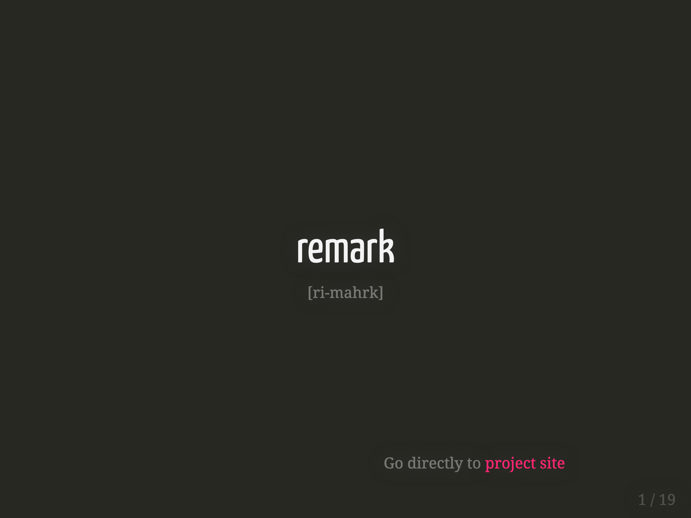

class: title

```{r setup, include=FALSE}
options(htmltools.dir.version = FALSE)
knitr::opts_chunk$set(
  fig.width = 10,
  fig.height = 6,
  fig.retina = 2,
  warning = FALSE,
  message = FALSE,
  echo=FALSE
)
source(here::here("static", "slides", "R", "components.R"))
# use_placeholders(TRUE, TRUE)
xaringanExtra::use_xaringan_extra(c("tile_view", "animate_css", "share_again"))
xaringanExtra::use_editable(id = rmarkdown::metadata$title)

library(fontawesome)
```

```{r js4shiny, echo=FALSE}
js4shiny::html_setup(stylize = c("fonts", "variables", "code"))
```

`r title_slide()`

---
class: inverse, middle, center

# Welcome!

## Let's learn how to make great slides<br> with xaringan (and friends)

### Let's review a few things

---

#  xaringan

.f7.pull-left[
.center[


.pkg[xaringan] introduces <br>.b[remark.js] to .pkg[rmarkdown]


]]
.mt4.pull-right[

<a href="https://slides.yihui.org/xaringan">xaringan documentation</a>

]

---

# remark.js

.pull-left[
.center[
### `r fa("js-square", height="3em", a11y="deco")` <br>JavaScript

.f6.b[and]

### `r fa("markdown", height="3em", a11y="deco")`<br>Markdown
]
]

.pull-right[
"A simple, in-browser, Markdown-driven slideshow tool targeted at people who know their way around HTML and CSS."

<a href="https://remarkjs.com">remarkjs documentation</a>

]


---
class: f7

## CSS

.f6.mb4[
**CSS** stands for **C**ascading **S**tyle **S**heet, and turns...
]

.pull-left[
functional, but dull HTML (content)...


]

.pull-right[
...into HTML (content) with style! `r emo::ji("sunglasses")`<br><br>


]

???
Remark helps us:
- create a new kind of slide using Markdown syntax and slide properties
- format slides (e.g. with content alignment)
- present (using keyboard shortcuts)

---
class: header_background f6

# Let's get started!

Restart your R session  <kbd>Ctrl</kbd> + <kbd>Shift</kbd> + <kbd>F10</kbd>

.mt4[
Open `01-introduction/01-start.Rmd`
]

.mt4[
Run `xaringan::infinite_moon_reader()` to preview the slides
]

---
# YAML

```yaml
---
title: "01 - Setting the Stage"
subtitle: "Professional, Polished, Presentable"
author: "Dr. Avahi Cleesei"
institute: "Bemaraha University, Madagascar"
date: "2021-07-07"
output:
  xaringan::moon_reader:              # xaringan output
    nature:
      slideNumberFormat: "%current%"  # slide number format
      highlightStyle: github          # highlighting syntax for code
      highlightLines: true            # code line highlighting
      ratio: 16:9                     # 4:3 for standard size
      countIncrementalSlides: true    # incremental slide counting
---
```

---
# Setup chunk

```r
# suppresses the version number in the subdirectory name
options(htmltools.dir.version = FALSE)

# preset options
knitr::opts_chunk$set(
  fig.retina = 2,             # specifies scaling for retina displays
  warning = FALSE,            # warning messages do not show
  message = FALSE             # informational messages do not show
)

# loads packages
library(fontawesome)          # FontAwesome icon package
library(tidyverse)            # collection of data science packages        
```

---
class: header_background, middle, center, f6

# Activity Time

## `r fa("theater-masks")` [materials/act-01/01-introduction](/materials/act-01/01-introduction/#activity)

Time for the .pkg[xaringan] scavenger hunt!
