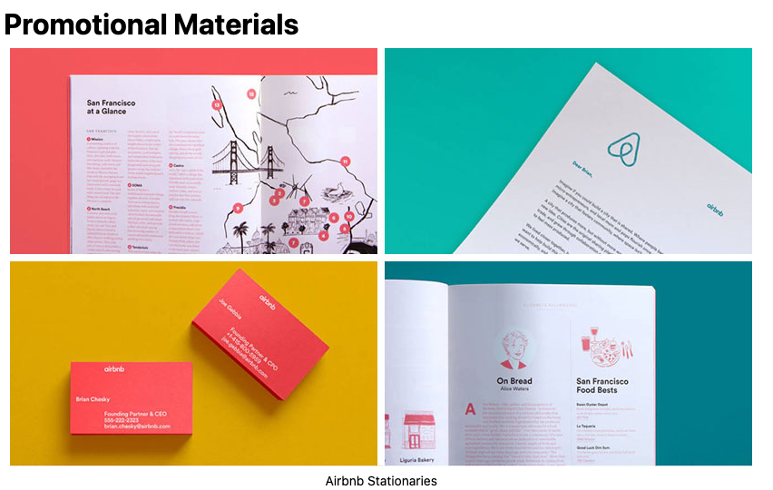

class: title

```{r setup, include=FALSE}
options(htmltools.dir.version = FALSE)
knitr::opts_chunk$set(
  fig.width = 10,
  fig.height = 6,
  fig.retina = 2,
  warning = FALSE,
  message = FALSE
)
source(here::here("static", "slides", "R", "components.R"))
# use_placeholders(TRUE, TRUE)
xaringanExtra::use_xaringan_extra(c("tile_view", "editable", "share_again", "animate_css"))
xaringanExtra::use_editable(id = rmarkdown::metadata$title)
```

```{r js4shiny, echo=FALSE}
js4shiny::html_setup(stylize = c("fonts", "variables", "code"))
```

```{css echo=FALSE}
.blue--hover:hover, .blue--hover:focus {
  color: var(--blue);
}
```

`r title_slide()`

---
class: header_background

# Do you have your style guide?

.flex.w-100.items-start.justify-center.mt4[

<div class="ba bw1 br3 b--silver w-80 pv2 silver f4 relative" style="padding-left:2.5em;">
<button class="absolute left-1 b--none silver pa0 ma0 blue--hover grow bg--white" id="fake-search">
<svg aria-hidden="true" role="img" viewBox="0 0 512 512" style="height:1em;width:1em;vertical-align:-0.125em;margin-left:auto;margin-right:auto;font-size:inherit;fill:currentColor;overflow:visible;position:relative;"><path d="M505 442.7L405.3 343c-4.5-4.5-10.6-7-17-7H372c27.6-35.3 44-79.7 44-128C416 93.1 322.9 0 208 0S0 93.1 0 208s93.1 208 208 208c48.3 0 92.7-16.4 128-44v16.3c0 6.4 2.5 12.5 7 17l99.7 99.7c9.4 9.4 24.6 9.4 33.9 0l28.3-28.3c9.4-9.4 9.4-24.6.1-34zM208 336c-70.7 0-128-57.2-128-128 0-70.7 57.2-128 128-128 70.7 0 128 57.2 128 128 0 70.7-57.2 128-128 128z"/></svg>
</button>
<div class="can-edit">airbnb branding guide</div>
</div>

]

--

<div class="animated bounceInLeft" style="position:absolute; bottom: 80px;">

</div>

<div class="animated bounceInUp delay-1s" style="position: absolute; bottom: 60px; left: 280px;">

</div>

<div class="animated bounceInUp delay-2s" style="position: absolute; bottom: 140px; right: 340px;">

</div>

<div class="animated bounceInRight delay-3s" style="position: absolute; bottom: 40px; right: 80px;">

</div>

```{js echo=FALSE, js_redirect=FALSE}
document.getElementById("fake-search").addEventListener("click", function() {
  slideshow.gotoNextSlide()
})
```

---

```{r echo=FALSE}
external_link <- function(link, title) {
  htmltools::tagList(
    title,
    htmltools::tags$a(
      href = link,
      fontawesome::fa("external-link-square-alt", title = title, a11y = "sem")
    )
  )
}
```

# Our favorite style guides

- `r external_link("https://design-system.service.gov.uk/", "GOV.UK Design System")`

- `r external_link("http://urbaninstitute.github.io/graphics-styleguide/", "Urban Institute Data Visualization Style Guide")`

- `r external_link("https://designsystem.digital.gov/", "U.S. Web Design System")`

- `r external_link("https://adele.uxpin.com/", "Adele: A Design System Repository")`

---
class: break center middle


---
layout: true

# xaringanthemer

---


---

.pull-left[

]

--

.pull-right[

]

---

````
```{r xaringan-themer, include=FALSE, warning=FALSE}`r ''`
library(xaringanthemer)

style_duo_accent(
  primary_color = "#1381B0",
  secondary_color = "#FF961C",
  inverse_header_color = "#FFFFFF"
)
```
````

---

````
```{r xaringan-themer, include=FALSE, warning=FALSE}`r ''`
library(xaringanthemer)

*style_duo_accent(
  primary_color = "#1381B0",
  secondary_color = "#FF961C",
  inverse_header_color = "#FFFFFF"
*)
```
````

.pull-left[
<h3 class="mv1 tc bb bw1">Monotone</h3>

- `style_mono_light()`
- `style_mono_dark()`
- `style_mono_accent()`
- `style_mono_accent_inverse()`
]

.pull-right[
<h3 class="mv1 tc bb bw1">Duotone</h3>

- `style_duo()`
- `style_duo_accent()`
- `style_duo_accent_inverse()`
]

---
class: header_background center middle

# Activity Time

.blue.f4[
`r fontawesome::fa("theater-masks")`
[materials/act-01/02-style-guide](/materials/act-01/02-style-guide/#activity)
]

Build your own complete .pkg[xaringan] theme with .pkg[xaringanthemer]

