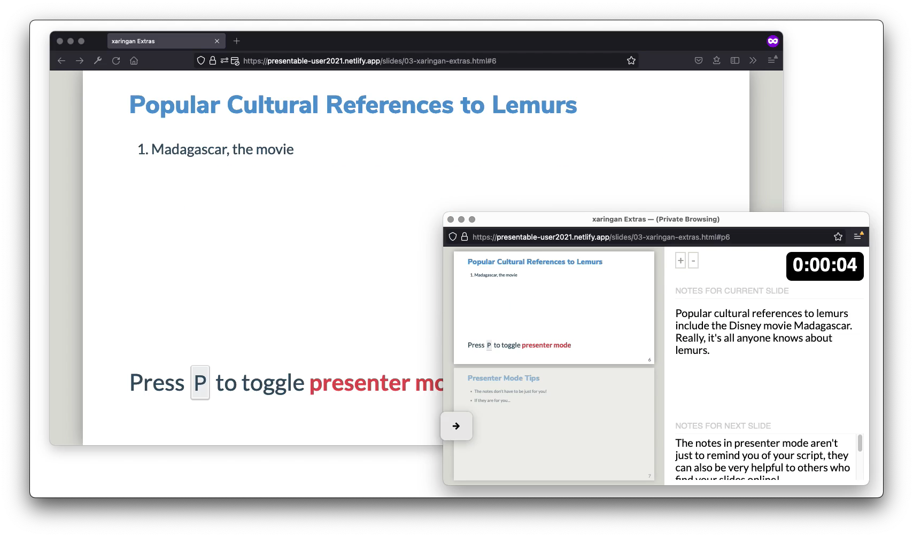

class: title

```{r setup, include=FALSE}
options(htmltools.dir.version = FALSE)
knitr::opts_chunk$set(
  fig.width = 10,
  fig.height = 6,
  fig.retina = 2,
  warning = FALSE,
  message = FALSE,
  fig.path = "assets/figure/03-xaringan-extras_"
)
source(here::here("static", "slides", "R", "components.R"))
# use_placeholders(TRUE, TRUE)
xaringanExtra::use_xaringan_extra(c("tile_view", "panelset", "share_again"))
xaringanExtra::use_editable(id = rmarkdown::metadata$title)
xaringanExtra::use_scribble(
  pen_color = "#d33f49", 
  pen_size = 4,
  palette = c("#d33f49", "#466683", "#338d70", "#c0af3f", "#ff6300", "#993d70")
)
```

```{r js4shiny, echo=FALSE}
js4shiny::html_setup(stylize = c("fonts", "variables", "code"))
```

`r title_slide()`

---

# That little bit &#x2728; .green[extra] &#x2728;

Using .pkg[xaringan] or .pkg[rmarkdown]

1. Presenter notes
1. Separate code chunks and their output

Using .pkg[xaringanExtra]

---
class: break center middle

# .f-marker[Presenter<br/>Notes]

---
class: f5

```md
---

## Popular Cultural References to Lemurs

1. Madagascar, the movie
```

---
class: f5

```md
---

## Popular Cultural References to Lemurs

1. Madagascar, the movie

???

Popular cultural references to lemurs include the Disney movie Madagascar. Really, it's all anyone knows about lemurs.
```

---

## Popular Cultural References to Lemurs

1. Madagascar, the movie

.absolute.bottom-1.left-2.f5[
Press <kbd>P</kbd> to toggle **presenter mode**
]

???

Popular cultural references to lemurs
include the Disney movie Madagascar.
Really, it's all anyone knows about lemurs.

---

## Presenter Mode Tips

- The notes don't have to be just for you!

- If they are for you...

???

The notes in presenter mode aren't just to remind you of your script,
they can also be very helpful to others who find your slides online!

How can you view the presenter notes and share your screen at the same time?

--

### Presenting in video

1. .relative[Present from the private browser window .orange[without moon reader] ]

2. Clone the slides into a new window with <kbd>C</kbd>

3. Pick the full browser or the cloned window to share

4. Press <kbd>P</kbd> in the other window

???

Don't try to present from inside RStudio.
Instead, use a **private** browser window,
either from the slides shared online
or using the **knit** button.

Clone the slides into a new window and then choose either the small window or the full browser to share.
If you want people to only see the slides, share the cloned window.
If you want to share browser tabs, use the full browser.
Press 

---
class: fullscreen

<video controls width="1210" height="681">
    <source src="assets/img/03-xaringan-extras/sharing-with-presenter-notes.mp4" type="video/mp4">
    <source src="assets/img/03-xaringan-extras/sharing-with-presenter-notes.gif" type="video/gif">
    
</video>

---

class: break break-shiny

# Code + Plots

.f-lato.f6.i[
The greatest hard thing about xaringan.
]

---

```{r lemur-weight}
library(dplyr)
library(ggplot2)
lemurs <- readRDS("lemurs.rds")

lemurs %>%
  filter(
    common_name == "Ring-Tailed Lemur",
    between(age_at_wt_y, 1, 5)
  ) %>%
  ggplot() +
  aes(x = age_at_wt_y, y = weight) +
  geom_point() +
  labs(
    x = "Age at Weight",
    y = "Weight (g)",
    title = "Weight Gain of Young Ring-Tailed Lemurs"
  )
```

--

.absolute.right-1.top-0.bottom-0.w-35.blue.f3.tr[
How can we<br>show the **code**<br>and the **plot**<br>separately?
]

---
layout: true

# Two Little Things to Control Output

---

````
```{r lemur-weight}`r ''`
# any R code ...
```
````
---

````
```{r lemur-weight, eval=FALSE}`r ''`
# any R code ...
```
````

---

````
```{r lemur-weight, eval=FALSE}`r ''`
# any R code ...
```

---

```{r ref.label="lemur-weight", echo=FALSE}`r ''`

```
````

---

````
```{r lemur-weight}`r ''`
# plotting R code ...
```
````

---

````
```{r lemur-weight}`r ''`
# plotting R code ...
```


````

---

````
```{r lemur-weight, fig.show="hide"}`r ''`
# plotting R code ...
```

')`)
````

---

````
```{r lemur-weight, fig.show="hide"}`r ''`
# plotting R code ...
```

---

')`)
````

---

````
```{r lemur-weight, fig.show="hide"}`r ''`
# plotting R code ...
```

---
background-image: url(`r knitr::inline_expr('knitr::fig_chunk("lemur-weight", "png")')`)
background-size: cover

````

---

.panelset[

```{r lemur-weight-1, ref.label="lemur-weight", panelset = TRUE, echo=-1:-4}
```

]

---
layout: false
class: break break-xaringanextra center middle white

```{css echo=FALSE}
.break-xaringanextra {
  background-color: rgb(153, 70, 132);
  background-position: 0% 0%;
  background-repeat: repeat;
  background-attachment: scroll;
  background-image: linear-gradient(45deg, rgba(58, 58, 197, 0.5) 0%, rgba(58, 58, 197, 0.5) 16.667%, rgba(94, 66, 189, 0.5) 16.667%, rgba(94, 66, 189, 0.5) 33.334%, rgba(130, 74, 181, 0.5) 33.334%, rgba(130, 74, 181, 0.5) 50.001%, rgba(167, 82, 173, 0.5) 50.001%, rgba(167, 82, 173, 0.5) 66.668%, rgba(203, 90, 165, 0.5) 66.668%, rgba(203, 90, 165, 0.5) 83.335%, rgba(239, 98, 157, 0.5) 83.335%, rgba(239, 98, 157, 0.5) 100.002%), linear-gradient(135deg, rgb(124, 22, 73) 0%, rgb(124, 22, 73) 16.667%, rgb(149, 30, 78) 16.667%, rgb(149, 30, 78) 33.334%, rgb(174, 38, 83) 33.334%, rgb(174, 38, 83) 50.001%, rgb(200, 45, 88) 50.001%, rgb(200, 45, 88) 66.668%, rgb(225, 53, 93) 66.668%, rgb(225, 53, 93) 83.335%, rgb(250, 61, 98) 83.335%, rgb(250, 61, 98) 100.002%);
  background-size: auto;
  background-origin: padding-box;
  background-clip: border-box;
}
.link-purple a {
  color: var(--purple);
  text-decoration: underline;
}
.highlight-last-item > ul > li, 
.highlight-last-item > ol > li {
  opacity: 0.5;
}
.highlight-last-item > ul > li:last-of-type,
.highlight-last-item > ol > li:last-of-type {
  opacity: 1;
}
/* small fixes for scribble interacting with tachyons */
.xe-scribble__button {
  padding: 0 3px;
  height: 32px;
  line-height: 1;
}
:root {
  --primary: #4d8dc9;
  --secondary: #44bc96;
}
```

# .f-lato.normal[xaringanExtra]

---
layout: true
class: link-purple

# What can xaringanExtra do?

---

-   Add an overview of your presentation with [tile view](https://pkg.garrickadenbuie.com/xaringanExtra/#/tile-view)
-   Make your slides [editable](https://pkg.garrickadenbuie.com/xaringanExtra/#/editable)
-   Share your slides in style with [share again](https://pkg.garrickadenbuie.com/xaringanExtra/#/share-again)
-   Broadcast your slides in real time to viewers with [broadcast](https://pkg.garrickadenbuie.com/xaringanExtra/#/broadcast)
-   Scribble on your slides during your presentation with [scribble](https://pkg.garrickadenbuie.com/xaringanExtra/#/scribble)
-   Announce slide changes with a [subtle tone](https://pkg.garrickadenbuie.com/xaringanExtra/#/slide-tone)
-   Animate slide transitions with [animate.css](https://pkg.garrickadenbuie.com/xaringanExtra/#/animate-css)
-   Add tabbed panels to slides with [panelset](https://pkg.garrickadenbuie.com/xaringanExtra/#/panelset)
-   Add a logo to all of your slides with [logo](https://pkg.garrickadenbuie.com/xaringanExtra/#/logo)
-   Add a search box to search through your slides with [search](https://pkg.garrickadenbuie.com/xaringanExtra/#/search)
-   Use the [Tachyons CSS utility toolkit](https://pkg.garrickadenbuie.com/xaringanExtra/#/tachyons)
-   Add a live video feed of your [webcam](https://pkg.garrickadenbuie.com/xaringanExtra/#/webcam)
-   Add one-click code copying with [clipboard](https://pkg.garrickadenbuie.com/xaringanExtra/#/clipboard)
-   Always play gifs from the start with [freezeframe](https://pkg.garrickadenbuie.com/xaringanExtra/#/freezeframe)
-   Fit your slides to [fill the browser window](https://pkg.garrickadenbuie.com/xaringanExtra/#/fit-to-screen)
-   Add [extra CSS styles](https://pkg.garrickadenbuie.com/xaringanExtra/#/extra-styles)

---
layout: true
class: link-purple highlight-last-item

# **Some things** xaringanExtra can do

---

-   Add tabbed panels to slides with [panelset](https://pkg.garrickadenbuie.com/xaringanExtra/#/panelset)

--

-   Add an overview of your presentation with [tile view](https://pkg.garrickadenbuie.com/xaringanExtra/#/tile-view)

--

-   .can-edit[Make your slides [editable](https://pkg.garrickadenbuie.com/xaringanExtra/#/editable)]

--

-   Scribble on your slides during your presentation with [scribble](https://pkg.garrickadenbuie.com/xaringanExtra/#/scribble)

--

-   Share your slides in style with [share again](https://pkg.garrickadenbuie.com/xaringanExtra/#/share-again)

---
layout: false

# **How to use** xaringanExtra?

```r
library(remotes)
install_github("gadenbuie/xaringanExtra")
```

--

````markdown
```{r xaringanExtra, echo=FALSE}`r ''`
library(xaringanExtra)
use_xaringan_extra(
  c("tile_view", "panelset", "share_again", "editable")
)
use_scribble(
  pen_color = "#d33f49", 
  pen_size = 4,
  palette = c("#d33f49", "#466683", "#338d70", "#c0af3f", "#ff6300")
)
```
````

---
layout: true

# How to use **panelsets**

---

````markdown
*.panelset[


*]
````

---

````markdown
.panelset[
*.panel[

*]
]
````

---

````markdown
.panelset[
.panel[
*This content will show up in panel 1!
]
]
````

---

````markdown
.panelset[
*.panel[.panel-name[First panel]

This content will show up in panel 1!
]
]
````

---

````markdown
.panelset[
.panel[.panel-name[First panel]

This content will show up in panel 1!
]

*.panel[.panel-name[Second panel]
*
*This content will show up in the **second panel**!
*]
]
````

---

.panelset[
.panel[.panel-name[First panel]

This content will show up in panel 1!
]

.panel[.panel-name[Second panel]

This content will show up in the **second panel**!
]
]

---

````markdown

```{r lemur-weight}`r ''`
`r paste(knitr:::knit_code$get("lemur-weight")[-1:-4], collapse = "\n")`
```

````

---

````markdown
*.panelset[
```{r lemur-weight}`r ''`
`r paste(knitr:::knit_code$get("lemur-weight")[-1:-4], collapse = "\n")`
```
*]
````

---

````markdown
.panelset[
*```{r lemur-weight, panelset = TRUE}`r ''`
`r paste(knitr:::knit_code$get("lemur-weight")[-1:-4], collapse = "\n")`
```
]
````

---

.panelset[

```{r lemur-weight-2, ref.label="lemur-weight", panelset = TRUE, echo=-1:-4}
```

]

---
class: header_background center middle

# Activity Time

.f4[
.blue[`r fontawesome::fa("theater-masks")`]
[materials/act-01/03-xaringan-extras](/materials/act-01/03-xaringan-extras/#activity)
]

Practice controlling code output and using panelsets.
