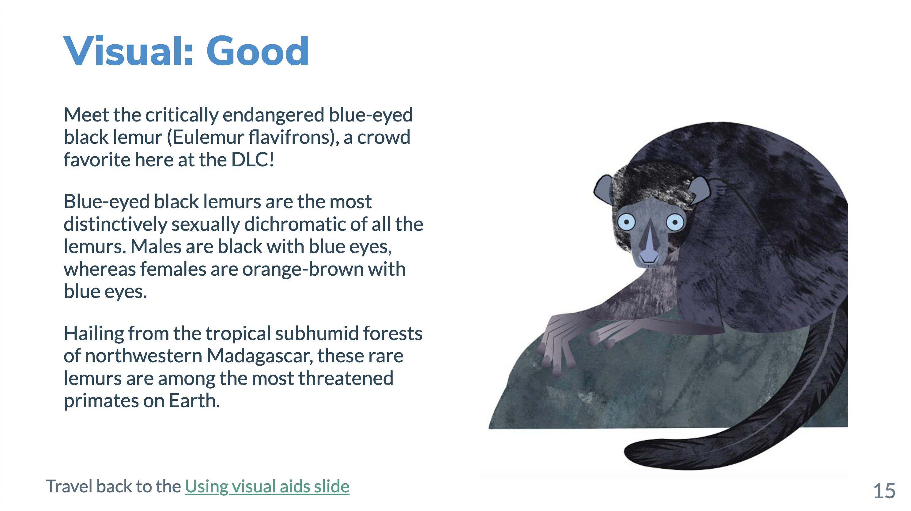
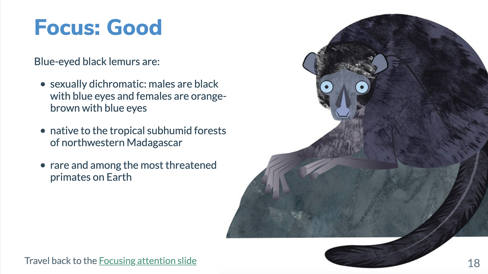
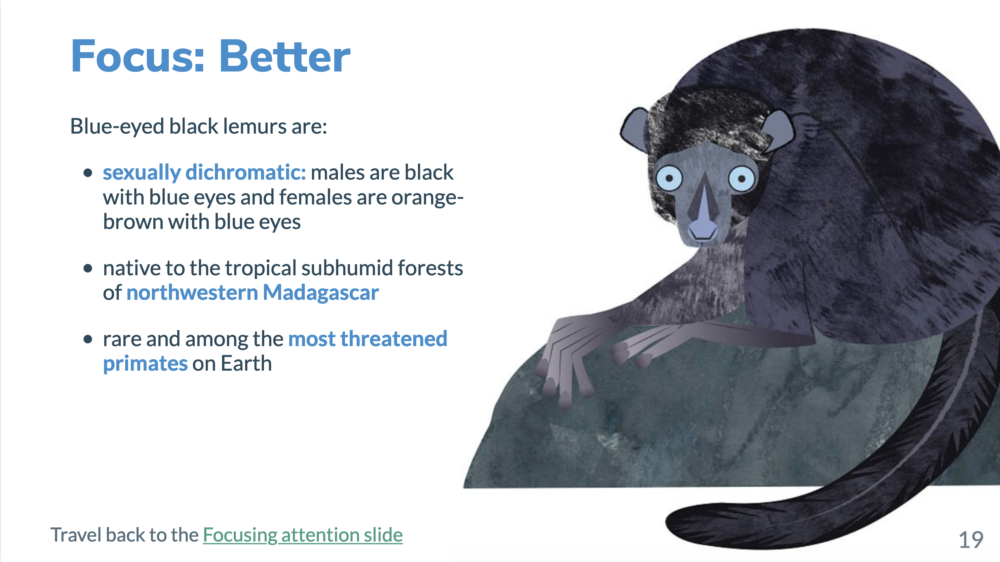
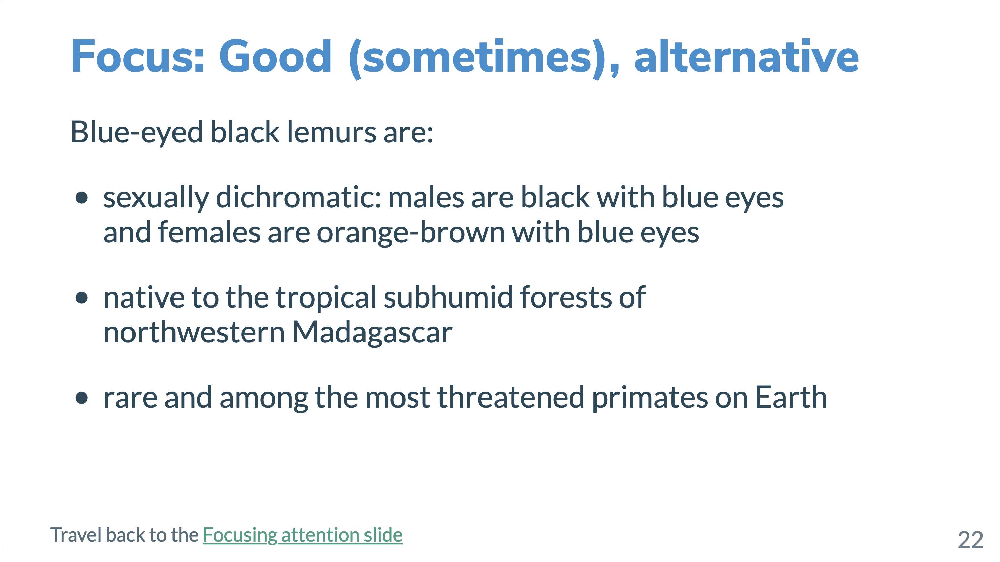
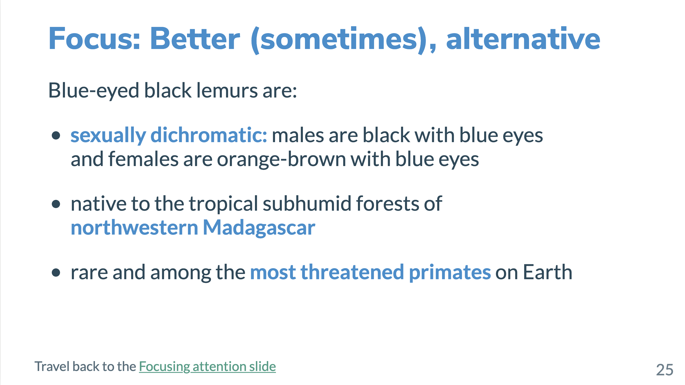

class: title

```{r setup, include=FALSE}
options(htmltools.dir.version = FALSE)
knitr::opts_chunk$set(
  fig.width = 10,
  fig.height = 6,
  fig.retina = 2,
  warning = FALSE,
  message = FALSE
)
source(here::here("static", "slides", "R", "components.R"))
# use_placeholders(TRUE, TRUE)
xaringanExtra::use_xaringan_extra(c("tile_view", "animate_css", "share_again", "panelset"))
xaringanExtra::use_editable(id = rmarkdown::metadata$title)

library(fontawesome)
```

```{r js4shiny, echo=FALSE}
js4shiny::html_setup(stylize = c("fonts", "variables", "code"))
```

`r title_slide()`

---
class: f6 inverse middle

.mh5[
# Effective communication<br>has the power to:

- capture the attention of your audience
- convince others of your findings
- help you teach more effectively
- reach a broader audience]

---
class: header_background

# How does xaringan already help us build effective presentations?

.f7.mt4.mh4[
`r fa("far fa-check-square", a11y="sem")` Use the right markup for your presentation’s structure

`r fa("far fa-check-square", a11y="sem")` Stick to widely used & open file formats

`r fa("far fa-square")` Make "accessible" your default mindset 

`r fa("far fa-square")` Design for the mode of delivery

`r fa("far fa-square")` Use clear and simple figures and graphics

`r fa("far fa-square")` Write clearly
]

.footnote[Guidelines from [Making Scientific Content More Accessible<br>by Goring, Stack Whitney, Jacob, Bruna, and Poisot](https://www.authorea.com/users/152134/articles/206076-making-scientific-content-more-accessible)]

---
background-image: url(assets/img/04/04-inclusive-design.png)
background-size: contain
background-position: right

# Make "accessible"<br>your default mindset

.f7[.pull-left[

We communicate effectively when we make our work .b[open] and .b[accessible] to a broad audience

Principles of [inclusive design](https://www.microsoft.com/design/inclusive/)
- Recognize exclusion
- Solve for one, extend to many
- Learn from diversity

<span role="img" aria-label="Something designed for a person who has one arm could be used just as effectively by a person with a temporary wrist injury or a new parent holding an infant"></span>

]]

.footnote[
[2.1 Make “accessible” your default mindset](https://www.authorea.com/users/152134/articles/206076-making-scientific-content-more-accessible/#author-label-make-accessible-your-default-mindset)<br>
Figure from the Inclusive Design 101 Toolkit by Microsoft
]

???
Recognizing exclusion helps us call on our humanity and powers of empathy

By designing for someone with a permanent disability, someone with a situational limitation can also benefit

By putting people at the center of our design process we learn from diverse perspectives and experiences

---
class:

# Design for the mode of delivery

.f7.mt4[.pull-left[

Slide presentations require .b[different design considerations] than papers or posters

Design content with .b[fewer and more focused details]

We don't have to format a<br>slide presentation like a paper

]]

.pull-right[
.bg-washed-yellow.b--yellow.ba.bw0.br0.shadow-5.pa2[
.b[Design tips:]
- Use context-relevant .b[visual aids] to help communicate your message

- Focus attention and include only the .b[most relevant details]

- Unify your content by .b[maintaining consistency] in layout and structure
]
]

.footnote[
[2.2 Design for the mode of delivery](https://www.authorea.com/users/152134/articles/206076-making-scientific-content-more-accessible/#author-label-design-for-the-mode-of-delivery)<br>
[Better Presentations: A Guide for Scholars, Researchers, and Wonks](https://policyviz.com/books/better-presentations/book-materials/) by Jonathan Schwabish]

---
name: visual

## `r fa("tasks")` In practice: Using visual aids

.panelset[
.panel[.panel-name[Not Good]

[Ex. slide: not good](#visual-not-good)

] <!--end of panel-->

.panel[.panel-name[Good]

[Ex. slide: good](#visual-good)

] <!--end of panel-->

.panel[.panel-name[Better]

[Ex. slide: better](#visual-better)

] <!--end of panel-->

.panel[.panel-name[Summary]

.f6[
- Avoid writing a "wall of text," break up the content

- Add a visual aid if it will help carry the message

- Turn your visual into a larger background image

- If your text overlaps with the background image, consider using CSS styling to give your text a background for contrast

]
] <!--end of panel-->

] <!--end of panelset-->

---
name: focus

## `r fa("tasks")` In practice: Focusing attention

.panelset[
.panel[.panel-name[Ok]

[Ex. slide: ok](#focus-ok)

] <!--end of panel-->

.panel[.panel-name[Good]

[Ex. slide: good](#focus-good)

] <!--end of panel-->

.panel[.panel-name[Better]

[Ex. slide: better](#focus-better)

] <!--end of panel-->

.panel[.panel-name[Good, alternative]

[Ex: good, alternative](#focus-good-alt)

] <!--end of panel-->

.panel[.panel-name[Better, alternative]

[Ex: better, alternative](#focus-better-alt)

] <!--end of panel-->

.panel[.panel-name[Summary]

.f6[

- Structure your text into smaller pieces and eliminate extra text

- Emphasize important words or phrases with text formatting

- Use incremental reveals to control the timing of content

  - .b[Note:] Provide a version of your slides without<br>incremental reveals for screen readers users

]

] <!--end of panel-->

] <!--end of panelset-->

---
class: f7
## `r fa("tasks")` In practice: Unifying your content

.mt4[
.pull-left[

### `r fa("th-large")` Layout

- Be consistent in your use of content classes

- Place text and images consistently between slides

- Balance content so that the slide is not too full
]

.pull-right[

### `r fa("th-list")` Structure
- Use headings and lists to provide hierarchy and organization

- Use color, font size, and<br> font type consistently

- Use a similar style or theme of images or photographs
]
]

---
# Use clear and simple figures & graphics

.mt4[
.pull-left[
.b.f6[Complex images and figures can be difficult for:]

.f7[

- your audience to process during your presentation

- you to describe out loud as you are presenting

- you to describe with alternative text (alt-text)
]]


.pull-right[
.center[
`r fa("chart-line", width="6em", fill="#75aadb")`&emsp;&emsp;
`r fa("chart-pie", width="6em", fill="#75aadb")`<br><br>

`r fa("chart-area", width="6em", fill="#75aadb")`&emsp;&emsp;
`r fa("chart-bar", width="6em", fill="#75aadb")`
]]]

.footnote[[2.4 Use clear and simple figures and graphics](https://www.authorea.com/users/152134/articles/206076-making-scientific-content-more-accessible/#author-label-use-clear-and-simple-figures-and-graphics)]

???
- complex images can direct the audience attention away from your main message

- complex images are harder to describe with alt text, which is necessary to make the image accessible to screen readers

---

# Write clearly

## Engage a broad audience with clear language

.f6[

- Provide descriptive slide headings

- Introduce and define abbreviations

- Define field-specific terminology

- Write to an audience outside of disciplinary<br> silos and even outside of academia
]

.footnote[[2.7 Write clearly](https://www.authorea.com/users/152134/articles/206076-making-scientific-content-more-accessible/#author-label-write-clearly)]

---
class: f6

## `r fa("tasks")` In practice: Writing clearly

.mt4[From [Web Accessibility in Mind](https://webaim.org/techniques/writing/#intelligent)

- 8th grade reading level if targeting a broad audience
- 12th grade level for an educated or specialized audience

From [The A11Y Project]()

- Audience between the ages of 12 and 15 years old<br><br>]

.b.f6[
## Let's [check the readability](https://www.webfx.com/tools/read-able/check.php) of our [lemur content](#focus-better)!]

---
class: header_background middle

# We are finished with this scene!

.f7.mt4.mh4[
`r fa("far fa-check-square")` Use the right markup for your presentation’s structure

`r fa("far fa-check-square")` Stick to widely used & open file formats

`r fa("far fa-check-square")` Make "accessible" your default mindset 

`r fa("far fa-check-square")` Design for the mode of delivery

`r fa("far fa-check-square")` Use clear and simple figures and graphics

`r fa("far fa-check-square")` Write clearly
]

## `r fa("theater-masks")` We can meet back at the [04 scene activity](/materials/act-02/04-effective-communication#activity)

---
class: inverse middle

# Example slides start here

### All slides use example text from the [Duke Lemur Center site](https://lemur.duke.edu/100-lemurs/)

---
name: visual-not-good

# Visual: Not Good

Meet the critically endangered blue-eyed black lemur (Eulemur flavifrons), a crowd favorite here at the DLC!

Blue-eyed black lemurs are the most distinctively sexually dichromatic of all the lemurs. Males are black with blue eyes, whereas females are orange-brown with blue eyes.

Hailing from the tropical subhumid forests of northwestern Madagascar, these rare lemurs are among the most threatened primates on Earth.

.footnote[Travel back to the [Using visual aids slide](#visual)]

???
No use of slide or content classes

### Demo

Use of `name: visual-not-good`

```
---
name: visual-not-good

<slide content>

---
```

The `name` can then be used for internal linking like in the slide that brought us to this one

```
[Example slide: not good](#visual-not-good)
```

---
name: visual-good

# Visual: Good

.pull-left[

Meet the critically endangered blue-eyed black lemur (Eulemur flavifrons), a crowd favorite here at the DLC!

Blue-eyed black lemurs are the most distinctively sexually dichromatic of all the lemurs. Males are black with blue eyes, whereas females are orange-brown with blue eyes.

Hailing from the tropical subhumid forests of northwestern Madagascar, these rare lemurs are among the most threatened primates on Earth.

]

.pull-right[
```{r fig.alt="Black lemur with black fur and blue eyes", out.width="100%", echo=FALSE}

```
]

.footnote[Travel back to the [Using visual aids slide](#visual)]

???
- `.pull-left[]` and `.pull-right[]` classes

- image inserted with `knitr::include_graphics()`

- `fig.alt=` code chunk

---
name: visual-better
background-image: url(assets/img/04/04-blue-eyed-black-lemur.png)
background-position: right
background-size: contain

# Visual: Better (sometimes)

.pull-left[

Meet the critically endangered blue-eyed black lemur (Eulemur flavifrons), a crowd favorite here at the DLC!

Blue-eyed black lemurs are the most distinctively sexually dichromatic of all the lemurs. Males are black with blue eyes, whereas females are orange-brown with blue eyes.

Hailing from the tropical subhumid forests of northwestern Madagascar, these rare lemurs are among the most threatened primates on Earth.
]

.footnote[Travel back to the [Using visual aids slide](#visual)]

???
- `.pull-left[]` and `.pull-right[]` classes

- image inserted using:

 - `background-image:` url(<url>)
 
 - `background-position:` right
 
 - `background-size:` contain

---
name: focus-ok
background-image: url(assets/img/04/04-blue-eyed-black-lemur.png)
background-position: right
background-size: contain

# Focus: Ok

.pull-left[

Meet the critically endangered blue-eyed black lemur (Eulemur flavifrons), a crowd favorite here at the DLC!

Blue-eyed black lemurs are the most distinctively sexually dichromatic of all the lemurs. Males are black with blue eyes, whereas females are orange-brown with blue eyes.

Hailing from the tropical subhumid forests of northwestern Madagascar, these rare lemurs are among the most threatened primates on Earth.
]

.footnote[Travel back to the [Focusing attention slide](#focus)]

???
- `.pull-left[]` and `.pull-right[]` classes

- image inserted using:

 - `background-image:` url(<url>)
 
 - `background-position:` right
 
 - `background-size:` contain

---
name: focus-good
background-image: url(assets/img/04/04-blue-eyed-black-lemur.png)
background-position: right
background-size: contain

# Focus: Good

.pull-left[

Blue-eyed black lemurs are:

- sexually dichromatic: males are black with blue eyes and females are orange-brown with blue eyes

- native to the tropical subhumid forests of northwestern Madagascar

- rare and among the most threatened primates on Earth
]

.footnote[Travel back to the [Focusing attention slide](#focus)]

???
- `.pull-left[]` and `.pull-right[]` classes

- image inserted using:

 - `background-image:` url(<url>)
 
 - `background-position:` right
 
 - `background-size:` contain
 
- use of an unordered list with dashes `-`

---
name: focus-better
background-image: url(assets/img/04/04-blue-eyed-black-lemur.png)
background-position: right
background-size: contain

# Focus: Better

.pull-left[

Blue-eyed black lemurs are:

- .b.blue[sexually dichromatic:] males are black with blue eyes and females are orange-brown with blue eyes

- native to the tropical subhumid forests of .b.blue[northwestern Madagascar]

- rare and among the .b.blue[most threatened primates] on Earth
]

.footnote[Travel back to the [Focusing attention slide](#focus)]

???
- `.pull-left[]` and `.pull-right[]` classes

- image inserted using:

 - `background-image:` url(<url>)
 
 - `background-position:` right
 
 - `background-size:` contain
 
- use of an unordered list with dashes `-`

- use of CSS classes to highlight text with a blue bold face

---
name: focus-good-alt

# Focus: Good (sometimes), alternative


.f6[Blue-eyed black lemurs are:

- sexually dichromatic: males are black with blue eyes<br>and females are orange-brown with blue eyes]

--

.f6[
- native to the tropical subhumid forests of<br>northwestern Madagascar]

--

.f6[
- rare and among the most threatened primates on Earth
]

.footnote[Travel back to the [Focusing attention slide](#focus)]

???
- use of an unordered list with dashes `-`

- incremental list items with `--` separator

---
name: focus-better-alt

# Focus: Better (sometimes), alternative

.f6[
Blue-eyed black lemurs are:

- .b.blue[sexually dichromatic:] males are black with blue eyes <br>and females are orange-brown with blue eyes]

--

.f6[
- native to the tropical subhumid forests of<br> .b.blue[northwestern Madagascar]]

--

.f6[
- rare and among the .b.blue[most threatened primates] on Earth
]

.footnote[Travel back to the [Focusing attention slide](#focus)]

???
- use of an unordered list with dashes `-`

- incremental list items with `--` separator

- use of CSS classes to highlight text with a blue bold face
