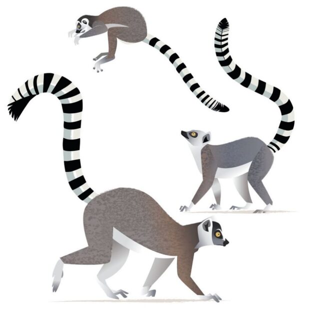

class: title

```{r setup, include=FALSE}
options(htmltools.dir.version = FALSE)
knitr::opts_chunk$set(
  fig.width = 10,
  fig.height = 6,
  fig.retina = 2,
  warning = FALSE,
  message = FALSE
)
source(here::here("static", "slides", "R", "components.R"))
# use_placeholders(TRUE, TRUE)
xaringanExtra::use_xaringan_extra(c("tile_view", "animate_css", "share_again", "panelset"))
xaringanExtra::use_editable(id = rmarkdown::metadata$title)

library(fontawesome)
```

```{r js4shiny, echo=FALSE}
js4shiny::html_setup(stylize = c("fonts", "variables", "code"))
```

`r title_slide()`

---
class: header_background f6

# Let's do this together!

Restart your R session <kbd>Ctrl</kbd> + <kbd>Shift</kbd> + <kbd>F10</kbd>

.mt4[
Open `05-accessible-design/05-start.Rmd`
]

.mt4[
Run `xaringan::infinite_moon_reader()` to preview your slides
]

---
class: inverse middle

# The power of the Web<br> is in its universality

## Access by everyone regardless of disability<br> is an essential aspect

.pull-right[.right[.f7[[Tim Berners-Lee](https://www.w3.org/standards/webdesign/accessibility)<br>W3C Director & inventor of<br>the World Wide Web]]]

???
Great web accessibility starts in the design

---
class: header_background

# How do we design<br>accessible presentations?

.f7.mt5.mh4[

`r fa("far fa-square")` &emsp;.b[Make "accessible" your default mindset]

`r fa("far fa-square")` &emsp;Support images with text 

`r fa("far fa-square")` &emsp;Make sure hyperlinks are clear & unambiguous

`r fa("far fa-square")` &emsp;Choose colors carefully

]

.footnote[Guidelines from [Making Scientific Content More Accessible<br>by Goring, Stack Whitney, Jacob, Bruna, and Poisot](https://www.authorea.com/users/152134/articles/206076-making-scientific-content-more-accessible)]

---
background-image: url(assets/img/04/04-inclusive-design.png)
background-size: contain
background-position: right

# Make "accessible"<br>your default mindset

.f7[.pull-left[

We communicate effectively when we make our work .b[open] and .b[accessible] to a broad audience

Principles of [inclusive design](https://www.microsoft.com/design/inclusive/)
- Recognize exclusion
- Solve for one, extend to many
- Learn from diversity

<span role="img" aria-label="Something designed for a person who has one arm could be used just as effectively by a person with a temporary wrist injury or a new parent holding an infant"></span>

]]

.footnote[
[2.1 Make “accessible” your default mindset](https://www.authorea.com/users/152134/articles/206076-making-scientific-content-more-accessible/#author-label-make-accessible-your-default-mindset)<br>
Figure from the Inclusive Design 101 Toolkit by Microsoft
]

???
We are returning to this core idea after covering it in the section on effective communication, because the two are intertwined

- Recognizing exclusion helps us call on our humanity and powers of empathy

- By designing for someone with a permanent disability, someone with a situational limitation can also benefit

- pBy putting people at the center of our design process we learn from diverse perspectives and experiences

---

# Support images with text

### Figures and graphics should include text<br>that describes the visual (alternative text)

.pull-left[

.f7[
.b[Alt-text] allows the reader to understand an image without seeing it

.b[Screen readers] provide voice or braille access to computer text, including alt-text]

]

.pull-right[
.bg-washed-yellow.b--yellow.ba.bw0.br0.shadow-5.pa2[
.b[Alt-text options for R Markdown:]
- Markdown

- R Markdown code chunks

- Raw HTML
]
]

.footnote[
[2.6 Support images with text](https://www.authorea.com/users/152134/articles/206076-making-scientific-content-more-accessible/#author-label-imagetext)]

???
Screen readers like VoiceOver for MacOS or NVDA for Windows are used by blind people as well as people with low vision, cognitive disabilities, deafness or hard-of-hearing, motor disabilities, and others. 

Many screen reader users experience more than one disability.

Alt text is also helpful when an image will not load, like in cases of slow internet connectivity 

---

## `r fa("tasks")` In practice: Add alt-text with Markdown `r fa("markdown")`

.pull-left[

.f7[
We can add alt-text to an image inserted with the `` syntax

Insert it between the square brackets:

```md

```
]]

.pull-right[


]

---

## `r fa("tasks")` In practice: Add alt-text with RMarkdown 

.f6[
We can add alt-text to an R Markdown code chunk output with the `fig.alt=""` option

````r
```{r, fig.alt="Ring-tailed lemurs with alternating black and white rings along the entire length of their tail"}`r ''`
knitr::include_graphics("ring-tailed-lemur.jpg")
```
````
]

.footnote[Resource: [New in knitr: Improved accessibility with image alt text by RStudio](https://blog.rstudio.com/2021/04/20/knitr-fig-alt/)]

---
class: header_background f6

# Add alt-text in slide 2

Add a text description to the lemur image slide on the slide titled "Ring-tailed Lemurs"

<div class="mt4 pre-name">05-start.Rmd</div>
````r
```{r, fig.alt=""}`r ''`
knitr::include_graphics("ring-tailed-lemur.jpg")
```
````

---

## `r fa("question-circle")` Is it a good idea to use the same alt-text for all images that are identical?

.pull-left[
### Not necessarily!

.f7[
To write effective alt-text we need to .b[consider the context]

What, if any, important information is the image supposed to communicate?
]
]

.pull-right[
.bg-washed-yellow.b--yellow.ba.bw0.br0.shadow-5.pa2[
.b[Resources]

- [Context is the most critical aspect of alt-text everyone seems to miss](https://uxdesign.cc/context-is-the-most-critical-aspect-of-alt-text-everyone-seems-to-miss-e18803a79212) by Sheri Byrne-Haber

- [An alt Decision Tree](https://www.w3.org/WAI/tutorials/images/decision-tree/) WAI Web Accessibility Tutorials

- [Images Concepts Tutorial](https://www.w3.org/WAI/tutorials/images/) by WAI Web Accessibility Tutorials]

]

---
# Make sure hyperlinks are<br>clear & unambiguous

.f7[
.pull-left[
- .b[Embed hyperlinks] in slides with xaringan

- Links are most useful when they .b[make sense out of context]

- Links should be .b[clearly labeled]
]
]

.pull-right[
.bg-washed-red.b--red.ba.bw0.br0.shadow-5.pa2[
.b[Avoid ambiguous links:]

- Here
- Click here
- Info
- More
- Read more
- Link

]
]


.footnote[[2.9 Make sure hyperlinks are clear & unambiguous](https://www.authorea.com/users/152134/articles/206076-making-scientific-content-more-accessible/#author-label-make-sure-hyperlinks-are-clear-unambiguous)<br>
[Link Text and Appearance](https://webaim.org/techniques/hypertext/link_text#uninformative) by Web Accessibility in Mind]

---
class: header_background f6

# Edit the link text to be more descriptive

Edit the slide titled "Ring-tailed Lemurs" to replace the link titled ".b[here]" with link text that makes sense out of context

<div class="mt4 pre-name">05-start.Rmd</div>
````md
The Duke Lemur Center provides more information [here](https://lemur.duke.edu/accordions/ring-tailed-lemurs-species-page/)
````

---
background-image: url(assets/img/05/dwarf-lemur.jpg)
background-position: right
background-size: contain

# Choose colors carefully

.pull-left[
.f7[

- Avoid using color as the .b[only] way to indicate priority or importance

- Check for .b[color independence] early and often by [simulating a grayscale display](https://developer.mozilla.org/en-US/docs/Tools/Accessibility_inspector/Simulation)

- Check the colors in your palette for adequate [color contrast](https://webaim.org/articles/contrast/#intro)

]]

.footnote[[2.5 Choose colors carefully](https://www.authorea.com/users/152134/articles/206076-making-scientific-content-more-accessible/#author-label-choose-colors-carefully)<br>
[Color and accessibility](https://designsystem.digital.gov/design-tokens/color/overview/#color-and-accessibility) by U.S. Web Design System
]

---
class: header_background f7

# Check your color palette for contrast

- Use one of the following color contrast checkers

  - [Contrast Checker](https://webaim.org/resources/contrastchecker/) by WebAIM (recommended)
  
  - [A11Y Rocks Color Palette](https://a11yrocks.com/colorPalette/) by Matt Long
  
  - [Accessible color palette builder](https://toolness.github.io/accessible-color-matrix/) by Atul Varma

- For an extensive gallery of color color combinations with adequate contrast, see the [Tachyons documentation for Theme Skins](https://tachyons.io/docs/themes/skins/)


## Let's check color independence and <br>color contrast together!

---
class: header_background

# We are finished with the scene!

.f7.mt4.mb4.mh4[
`r fa("far fa-check-square")` &emsp;Make "accessible" your default mindset

`r fa("far fa-check-square")` &emsp;Support images with text 

`r fa("far fa-check-square")` &emsp;Make sure hyperlinks are clear & unambiguous

`r fa("far fa-check-square")` &emsp;Choose colors carefully
]

## `r fa("theater-masks")` [materials/act-02/05-accessible-design](/materials/act-02/05-accessible-design/#activity)
