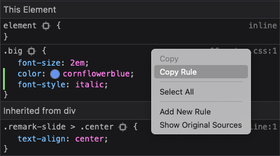

class: title

```{r setup, include=FALSE}
options(htmltools.dir.version = FALSE)
set.seed(4242)
knitr::opts_chunk$set(
  fig.width = 10,
  fig.height = 6,
  fig.retina = 2,
  warning = FALSE,
  message = FALSE
)
source(here::here("static", "slides", "R", "components.R"))
# use_placeholders(TRUE, TRUE)
xaringanExtra::use_xaringan_extra(c("tile_view", "animate_css", "share_again"))
xaringanExtra::use_editable(id = rmarkdown::metadata$title)
```

```{r js4shiny, echo=FALSE}
js4shiny::html_setup(stylize = c("fonts", "variables", "code"))
```

`r title_slide()`

---
class: header_background f6

# Let's do this together!

Restart your R session  <kbd>Ctrl</kbd> + <kbd>Shift</kbd> + <kbd>F10</kbd>

.mt4[
Open `06-intro-css/06-start.Rmd`
]

---
name: remark-example

class: f4

<pre><code style="color: #999">.pull-left&#8288;[
!&#8288;[cute lemur]&#8288;(lemur.jpg)
]

.pull-right&#8288;[
Lemurs are the cutest.
]

.footnote&#8288;[Duke Lemur Center]
</code></pre>

<script>
const remarkExample = document.getElementById('slide-remark-example').querySelectorAll('.remark-code-line')
;[0,2].forEach(idx => remarkExample[idx].classList.add('red', 'b'))
;[4,6].forEach(idx => remarkExample[idx].classList.add('blue', 'b'))
remarkExample[8].innerHTML = `<span class="orange b">.footnote&#8288;[</span>Duke Lemur Center<span class="orange b">&#8288;]</span>`
</script>

???

You've probably encountered remark's dot-name-bracket notation before.
The most common examples in the default slides are `.pull-left[]`, `.pull-right[]` and `.footnote[]`.
We can use this syntax to modify the appearance or position of the text in our slides.
And most importantly, we can create our own versions.

---
class: header_background

# Use .code[.big&#8288;[]] in the first slide

1. Launch `infinite_moon_reader()` 

1. Put `.big[ ]` around just **a few words** on the slide

`r countdown::countdown(1)`

---
class: f5

<div class="mt4 pre-name">06-start.Rmd</div>

```
---
class: center middle

Lemurs are the .big[most endangered] mammals on Earth


```

???

Your slide source code probably looks like this now

---
class: center middle

Lemurs are the .big[most endangered] mammals on Earth


--
name: rendered-example

.footnote[ .ml1[Open the slides in your browser]]

???

Open the slides in Chrome or Firefox.

Right click on the embiggened words and select  _Inspect Element_

What rules are being applied to this element?

Adjust `font-size` rule of the `.big` class

---
class: header_background

# Make the .code[.big] class your own

1. .b[Set the `color` to your favorite color.]

   Here are a few to try:

    - `DeepPink`
    - `CornFlowerBlue`
    - `RosyBrown`
    - `SeaGreen`
    
1. .b[Find another property to change.]

   Try typing `font-` and pressing <kbd>Tab</kbd>    

`r countdown::countdown(1)`

---
class: header_background

# Copy the rule into your .code[extra.css] file

1. .b[Right Click] on [the rule](#rendered-example) and select .i[Copy Rule]

   

2. .b[Paste the rule into `extra.css`] and save to update

---
class: header_background

# Write your own rule

1. Follow the pattern from `.big` to write your own rule called `.fade`

    - Set `opacity` to `0.66`

1. Then, put `.fade[]` around the lemur image

`r countdown::countdown(2, top = "3rem")`

--

.mb0[
<div class="pre-name">extra.css</div>
```{css echo=TRUE, eval=FALSE}
.fade {
  opacity: 0.66;
}
```
]

<div class="mt0 pre-name">06-start.Rmd</div>
```
.fade[

]
```

---
layout: true

# Anatomy of a CSS rule

---

.code.f4.mh-a.mt4[
.purple[selector] {<br>
.ml4[.dark-green[property]: .blue[value];]<br>
.ml4[.dark-green[property]: .blue[value];]<br>
}
]

---
class: animated fadeIn

.code.f4.mh-a.mt4[
.purple[.big] {<br>
.ml4[.dark-green[font-size]: .blue[2em];]<br>
.ml4[.dark-green[color]: .blue[CornFlowerBlue];]<br>
}
]

---
layout: true
class: f4 middle animated fadeIn

<pre><code style="color: #999">.pull-right&#8288;[
Lemurs are .big&#8288[the cutest].
]</code></pre>

---

Lemurs are the cutest

---
name: inline-vs-block-inline

Lemurs are .bg-washed-blue.blue.b--dashed.ph1[the cutest]

<script>
const exInline = document.getElementById('slide-inline-vs-block-inline').querySelectorAll('.remark-code-line')
// ;[0,2].forEach(idx => exInline[idx].classList.add('red', 'b'))
exInline[1].innerHTML = `Lemurs are <span class="blue b">.big&#8288;[</span><span class="blue">the cutest</span><span class="blue b">&#8288;]</span>`
</script>

???

_Inline_ elements are like inline R code.
They modify a small snippet of text

---
name: inline-vs-block-block

<div class="bg-washed-red red b--dashed p  a1 mv3">Lemurs are the cutest</div>

<script>
const exBlock = document.getElementById('slide-inline-vs-block-block').querySelectorAll('.remark-code-line')
;[0,1,2].forEach(idx => exBlock[idx].classList.add('red', idx == 1 ? 'normal' : 'b'))
</script>

???

_Block_ elements are like R code chunks.
They're a whole chunk of _something_.

---
layout: false
class: middle

.pull-left[
<pre><code style="color: #999">.pull-right&#8288;[
Lemurs are .big&#8288[the cutest].
]</code></pre>
]

.pull-right[
Lemurs are .big[the cutest].
]

.footnote[ .ml1[Inspect the output]]

???

Let's see how xaringan and remark render the markdown on the left.

---
class: middle animated fadeIn

.pull-left[
```{html eval=FALSE}
<div class="pull-right">
  <p>
    Lemurs are 
    <span class="big">
      the cutest
    </span>.
  </p>
</div>
```
]

.pull-right[
Lemurs are .big[the cutest].
]

???

In the HTML we see the `.pull-right` is used for a `<div>` tag (block element)
and the `.pull-left` is used for a `<span>` tag (inline element).

---
class: header_background

# Another place to put CSS (temporarily)

The second slide contains a figure, using the `knitr::fig_chunk()` trick we learned earlier.

With `infinite_moon_reader()` running...

- Add a `<style>` tag to the slide markdown

   ```
   <style>
   
   </style>
   ```
   
- In the next task, write you CSS inside the `<style>` tag.
  The slides will update live!

---
class: header_background

# Move the figure


1. Put the figure in a `.bottom-right[]`.

1. Create a new CSS rule in `extra.css` called `.bottom-right`

1. Set the `position` property to `absolute`

1. Set the `width` and `height` properties

   - Try values like `200px` or `450px`

1. Set the `bottom` and `right` properties to a CSS _distance_

    - Try values like `1.5em` or `2em`
    
1. *Bonus* Give the plot a [border](https://developer.mozilla.org/en-US/docs/Web/CSS/border)
    
`r countdown::countdown(3)`

---
class: middle


```{css eval=FALSE}
.bottom-right {
  position: absolute;
  bottom: 1.5em;
  right: 2em;
  width: 450px;
  height: 200px;
  border: 2px solid gray;
}
```
