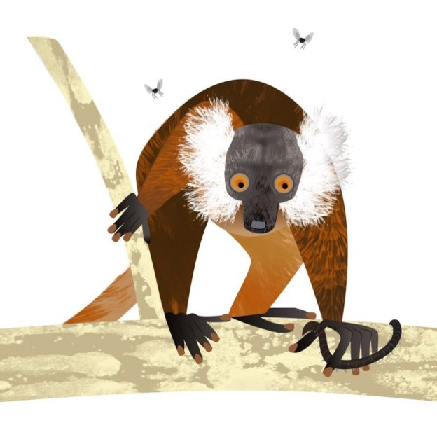

class: title

```{r setup, include=FALSE}
options(htmltools.dir.version = FALSE)
knitr::opts_chunk$set(
  fig.width = 10,
  fig.height = 6,
  fig.retina = 2,
  warning = FALSE,
  message = FALSE
)
source(here::here("static", "slides", "R", "components.R"))
# use_placeholders(TRUE, TRUE)
xaringanExtra::use_xaringan_extra(c("tile_view", "animate_css", "share_again"))
xaringanExtra::use_editable(id = rmarkdown::metadata$title)

library(fontawesome)
```

```{r js4shiny, echo=FALSE}
js4shiny::html_setup(stylize = c("fonts", "variables", "code"))
```

`r title_slide()`

---
class: header_background f6

# Let's do this together!

Restart your R session <kbd>Ctrl</kbd> + <kbd>Shift</kbd> + <kbd>F10</kbd>

.mt4[
Open `07-accessibility-css-html/07-start.Rmd`
]

.mt4[
Run `xaringan::infinite_moon_reader()` to preview your slides
]

---

# Adding alt-text with HTML

.f6[
We can add alt-text to an `` tag using raw HTML<br>by using the `alt` attribute

```html

```
]

.footnote[Resource: [Alternative text basics by WebAIM](https://webaim.org/techniques/alttext/#basics)]

---
class: f6 middle

## `r fa("info-circle")` Fun fact

.pull-left[

Common black lemurs will coax toxic millipedes to release toxins `r emo::ji("bug")`...

...and then will use these toxins as insect repellant<br>by rubbing the millipedes all over their fur!

]

.pull-right[

]

---
class: header_background f6

# Replace the alt-text in slide 3

.pull-left[
.mt4[
In the slide titled "Common black lemurs are sexually dichromatic," .b[replace]:]

<div class="mt4 pre-name">07-start.Rmd</div>
```html
alt = "Common black lemur with a millipede in one hand and flies hovering overhead"
```
]

.pull-right[
.mt4[
.b[With this alternative] that better matches the information being conveyed:]

<div class="mt4 pre-name">07-start.Rmd</div>
```html
alt = "Female common black lemur with brown-orange fur and white ear tufts"
```
]

---
class: f6
name: special-attributes

# Adding alt text to background images

### `r fa("question-circle")` What if we need to add alt-text to background images?

We can use the `<span>` tag and some special attributes like `role` and `aria-label`

```html
<span role="img" aria-label="Male common black lemur with rich black fur covering their entire body, and black ear tufts"></span>
```

---
class: f7

## `r fa("tasks")` In practice:

<div class="mt4 pre-name">07-start.Rmd</div>
```
---
class: bottom
background-image: url(common-black-lemur-male.jpg)
background-size: cover

# Adding<br>alt-text to<br>background<br>images

<span role="img" aria-label="Male common black lemur with rich black fur covering their entire body, and black ear tufts"></span>
---
```

---
class: bottom
background-image: url(assets/img/common-black-lemur-male.jpg)
background-size: cover

# Adding<br>alt-text to<br>background<br>images

<span role="img" aria-label="Male common black lemur with rich black fur covering their entire body, and black ear tufts"></span>


---
class: f6

# Styling links so that color<br>is not the only indicator

```{css, echo=FALSE}
.ul {
  text-decoration: underline;
}
```

Links should be easy to identify among non-link content,<br>like with .ul[text underlining]
 
We can use the [text-decoration CSS property](https://developer.mozilla.org/en-US/docs/Web/CSS/text-decoration) to <br>style the `a` (anchor) element.

```css
a {
  text-decoration: underline;
}
```


---
class: header_background f6

# Apply underlining to your link text

1\. .b[Navigate to the slide] titled "Styling links"

2\. .b[Paste the CSS rule into `extra.css`] and save to update

<div class="mt4 pre-name">extra.css</div>
```css
a {
  text-decoration: underline;
}
```

---
class: f6

# Transforming text to uppercase

We can style text with .b.upper[UPPERCASE] for emphasis or aesthetics.

Typing capitalized letters individually can cause<br> [screen readers to read each letter individually](https://webaim.org/techniques/screenreader/#how), like an acronym.

We can apply .upper[UPPERCASE] styling using the<br> [text-transform CSS property](https://developer.mozilla.org/en-US/docs/Web/CSS/text-transform)

```css
.upper {
  text-transform: uppercase;
}
```

---
class: f6 middle

The `.upper[]` class produces .upper[Capitalized Words]<br> that still read like case-sensitive text to a screen reader
```css
.upper {
  text-transform: uppercase;
}
```


.b[Behind the scenes:]
```html
<span class="upper">
Capitalized Words</span>
```


---
class: header_background f6

# Apply an uppercase transformation

1\. .b[Navigate to the slide] titled "Transforming text to uppercase"

2\. .b[Paste the following rule into `extra.css`] and save to update

<div class="mt4 pre-name">extra.css</div>
```css
.upper {
  text-transform: uppercase;
}
```

---
class: f6

## `r fa("tasks")` In practice:

.pull-left[
<div class="mt4 pre-name">07-start.Rmd</div>
```md
Hello there, I'm transforming .upper[this text] to uppercase
```
]

.mt5.f6[
.pull-right[
Hello there, I'm transforming .upper[this text] to uppercase
]
]

.footnote[.b[Tip:] [Apply uppercase text judiciously](https://www.456bereastreet.com/archive/201012/use_uppercase_capitalised_text_judiciously/) because it can reduce legibility]

---
class: f6

# Using icons like `r fa("wikipedia-w", a11y="sem")` with context in mind

.code.b[fontawesome::fa("wikipedia-w", a11y="sem") `r fa("wikipedia-w", a11y = "sem")`]

"sem" is short for "semantic"

A .b[screen reader] will read the icon title text, like "Wikipedia W"

```r
fontawesome::fa("wikipedia-w", a11y="sem")
```

---
class: f6

.b[R code:]

```r
fontawesome::fa("wikipedia-w", a11y="sem")
```

.b[Behind the scenes:]

```html
<svg 
aria-label="Wikipedia W" 
img="role" 
...more SVG properties...>
  <title>Wikipedia W</title>
</svg>
```

---
class: f6

# Using icons like `r fontawesome::fa("wikipedia-w", a11y="sem")` with context in mind

.code.b[fontawesome::fa("wikipedia-w", a11y="deco") `r fontawesome::fa("wikipedia-w")`]

"deco" is short for "decorative" and the argument<br>`a11y = "deco"` is the default

A .b[screen reader] will skip over a decorative icon

```r
fontawesome::fa("wikipedia-w", a11y="deco")
```

.footnote[.b[Tip:] A decorative icon (or image) is appropriate only when it is .b[not] the only element conveying necessary information]


---
class: f6

.b[R code:]

```r
fontawesome::fa("wikipedia-w", a11y="deco")
```

.b[Behind the scenes:]

```html
<svg 
aria-hidden="true" 
img="role"
...more SVG properties...>
</svg>
```

---
class: f6

# Using icons like `r fa("wikipedia-w", a11y="sem")` with context in mind

### Raw <i class="fab fa-wikipedia-w"></i> HTML .code.b[`<i class="fab fa-wikipedia-w"></i>`]
<i class="fab fa-wikipedia-w"></i>

A .b[screen reader] will skip an icon with the basic HTML readily available on the [FontAwesome website](https://fontawesome.com/v5.15/icons/wikipedia-w?style=brands)

.mt4[
```html
<i class="fab fa-wikipedia-w"></i>
```
]

.mt4[We could add [accessibility attributes](#special-attributes) like `role` and<br> `aria-label` to make icon to be accessible on its own]

---
class: header_background, middle

# We are finished with this scene!

## `r fa("theater-masks")` We can meet back at the<br> [07-accessibility-css-html activity](/materials/act-03/07-accessibility-css-html/#activity)
