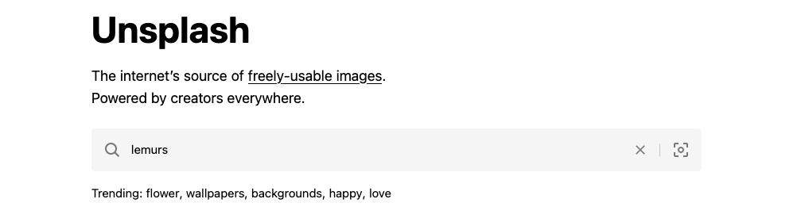
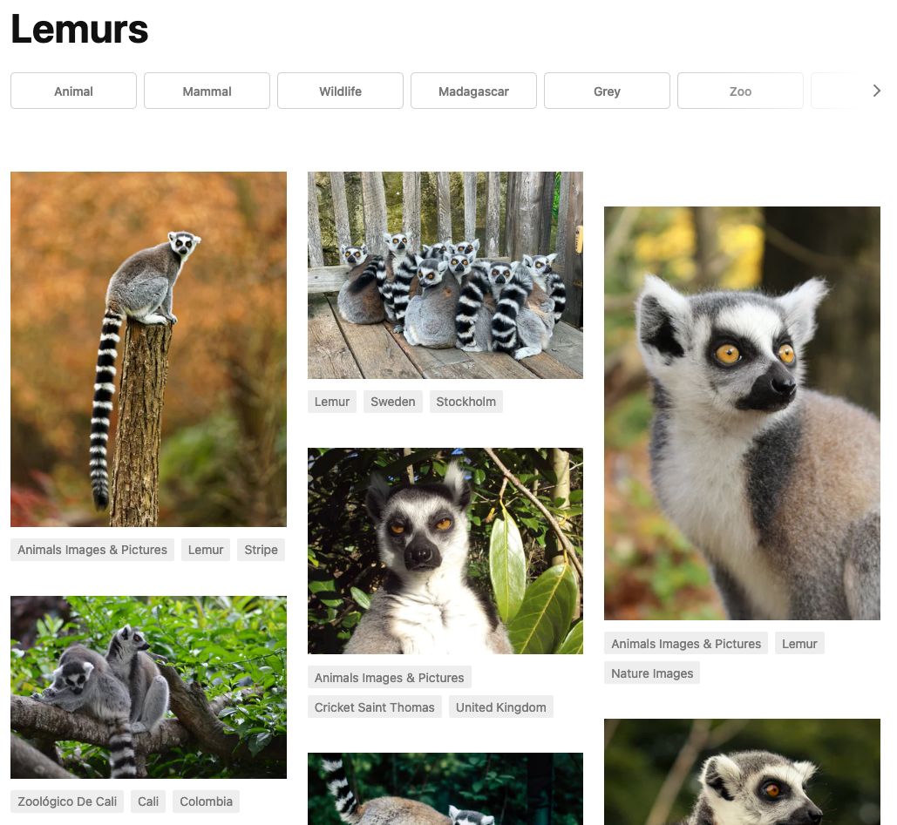

class: title

```{r setup, include=FALSE}
options(htmltools.dir.version = FALSE)
knitr::opts_chunk$set(
  fig.width = 10,
  fig.height = 6,
  fig.retina = 2,
  warning = FALSE,
  message = FALSE
)
source(here::here("static", "slides", "R", "components.R"))
# use_placeholders(TRUE, TRUE)
xaringanExtra::use_xaringan_extra(c("tile_view", "animate_css", "share_again"))
xaringanExtra::use_editable(id = rmarkdown::metadata$title)
```

```{r js4shiny, echo=FALSE}
js4shiny::html_setup(stylize = c("fonts", "variables", "code"))
```

`r title_slide()`

---
background-image: url(https://source.unsplash.com/aWXVxy8BSzc)
background-size: cover

<span role="img" aria-label="Slide background shows: An outdoor concert at a festival, from behind a large audience of fans all with their hands in the air.">/span>

.footnote.white[Photo by [Hanny Naibaho](https://unsplash.com/@hannynaibaho)]

???

Think about your favorite song?
How long would it take you to recognize it?
From the first note?
When you hear the chorus?

---
background-image: url(https://source.unsplash.com/_r0mZJ5QjXU)
background-size: cover

<span role="img" aria-label="Slide background shows: A busy, pedestrian-only street in Dublin; on the left a man stands on the sidewalk playing an acoustic guitar and singing into a microphone.">/span>

.footnote.white[Photo by [.white[Alejandro Lopez]](https://unsplash.com/@lopify)]

???

What if you heard the song somewhere totally different?
What would it take to recognize it on a crowded street?

---
background-image: url(https://source.unsplash.com/tq7RtEvezSY)
background-size: cover

<span role="img" aria-label="Slide background shows: the hands of a child playing piano in soft focus.">/span>

.footnote.white[Photo by [.white[Clark Young]](https://unsplash.com/@cbyoung)]

???

Or if you stripped it down to its most minimal parts, 
how much of the song would you need before you start to sing along.

---

.f2[
We can do something .blue[similar] with our slides
]

---
class: bottom right

.f4[
Consistency makes it .purple[EASIER] to follow
]

---
class: header_background

# Structure

.f5.mt4[
guides

.right.mt4[
your
]

.center.mt5[
attention
]
]

---
class: left middle

.f5[
Lorem ipsum dolor sit amet, .red[where] consectetur adipiscing elit,
sed do eiusmod tempor incididunt ut labore .green[should] et dolore
magna  aliqua. Ut enim ad minim veniam, quis nostrud
exercitation .orange[you] ullamco laboris nisi ut aliquip ex ea
commodo consequat. Duis aute irure dolor in 
reprehenderit .purple[be] in voluptate velit esse cillum dolore eu
fugiat nulla pariatur. Excepteur sint occaecat cupidatat
non proident, sunt in culpa qui .blue[looking?] officia deserunt mollit
anim id est laborum.
]

---
class: left middle

.f5.black-20[
Lorem ipsum dolor sit amet, .red[where] consectetur adipiscing elit,
sed do eiusmod tempor incididunt ut labore .green[should] et dolore
magna  aliqua. Ut enim ad minim veniam, quis nostrud
exercitation .orange[you] ullamco laboris nisi ut aliquip ex ea
commodo consequat. Duis aute irure dolor in 
reprehenderit .purple[be] in voluptate velit esse cillum dolore eu
fugiat nulla pariatur. Excepteur sint occaecat cupidatat
non proident, sunt in culpa qui .blue[looking?] officia deserunt mollit
anim id est laborum.
]

---
class: center middle bg-blue

# .white[Design Makes Communication Easier]

???

If you're anything like me, those last slides were distracting.
It was harder to follow what I was saying,
especially with the text in so many different places or 
so much visual information on the screen.

But you can use slide design to facilitate communication...

---
layout: true

class: f6

# Where can you apply design thinking?

---

.fl.w-20.b.tr.pr4[
Text
]
.fr.w-80[
Markdown or inline classes  
`.yellow[Watch out...]`
]

???

Use R Markdown and color consistently for specific words.
Can you think of any good examples?
(code vs packages)

Use xaringanthemer to set yourself up for success.

--

.fl.w-20.b.tr.pr4.cb[
Block
]
.fr.w-80[
Boxes or groups of content  
`.callout[ ... ]`
]

???

Boxes or groups of content. Example? `.pull-right`

Have to remember to apply it consistently,
so write your own classes with special meaning if it makes it easier.

--

.fl.w-20.b.tr.pr4.cb[
Slide
]
.fr.w-80[
Special kinds of slides  
`class: header_background`
]

???

Style the whole slide for special circumstances.
Examples: use `inverse` as a strong signal that you're changing topics.
Or we've used `header_background` from xaringanthemer to add a header to slides when it's *your turn* to do something.

---
layout: true

# One little thing: unsplash images

---



---

.w-75.center[

]

---

.w-60.ph2.tc.ba.bw1.b--light-gray.br3.center[
.code[.black[unsplash.com/photos/].red[FWA4Zk1hFls]]


]

---

.w-60.ph2.tc.ba.bw1.b--light-gray.br3.center[
.code[.black[source.unsplash.com/].red[FWA4Zk1hFls]]


]

---
layout: false
background-image: url(https://source.unsplash.com/FWA4Zk1hFls/1600x900)
background-size: cover

<span role="img" aria-label="Slide background shows: A group of ring-tailed lemurs huddled together in a wooden enclosure, looking directly at the camera.">/span>

.bg-black-70.white.absolute.top-0.left-0.code.pl2.animated.slideInDown.delay-2s[
background-image: url(https:&#x200B;//source.unsplash.com/.pink[FWA4Zk1hFls]/.green[1600x900])
background-size: cover
]

---
layout: false
class: header_background f5

# Choose your final activity

1. An interesting quote on a boring slide<br>&#x1F449; a fancy **quote slide**

1. A regular slide with a bit of text<br>&#x1F449; a sidebar image **slide template**

.blue[`r fontawesome::fa("theater-masks")`] [materials/act-03/09-design-components](https://presentable-user2021.netlify.app/materials/act-03/09-design-components/)
